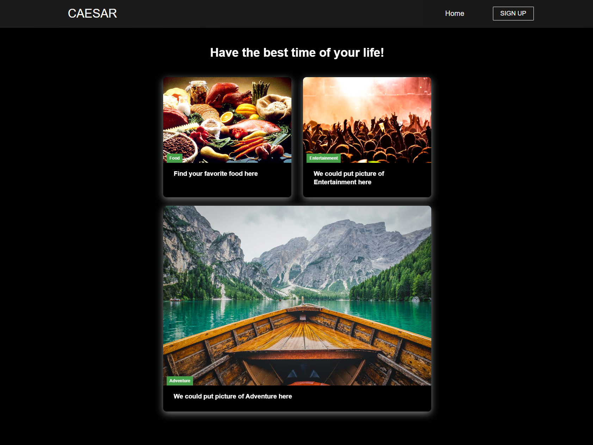

# CAESAR

## Description

Caesar is the start of a all-in-one vacation site!

## Table of contents

- [Usage](#Usage)
- [Visuals](#Visuals)
- [Credits](#Credits)
- [License](#License)

## Usage

This application runs on the browser.

## Deployment

[Caesar || Heroku App](https://afternoon-mesa-22613-3fdd9a909bc7.herokuapp.com/)

To run the code locally: 

> Clone the repository. 
> Download required packages: npm i. 
> Start the program: npm run develop. 
> The local application may be accessed on your browser using: http://localhost:3000/

## Visuals

## Credits
- Jakob Stephens: Schemas / Models/ Routes 
- Brian Adams: Schemas/Models/Backend
- Ruskin Acevedo: Front End / Client Side
- Matthew Standish: Mapbox/ API Routes 
- Blake Sanders: Server Side /Api Routes

## License

[MIT LICENSE](https://raw.githubusercontent.com/Ruskin20/Travel-Log/master/LICENSE)
