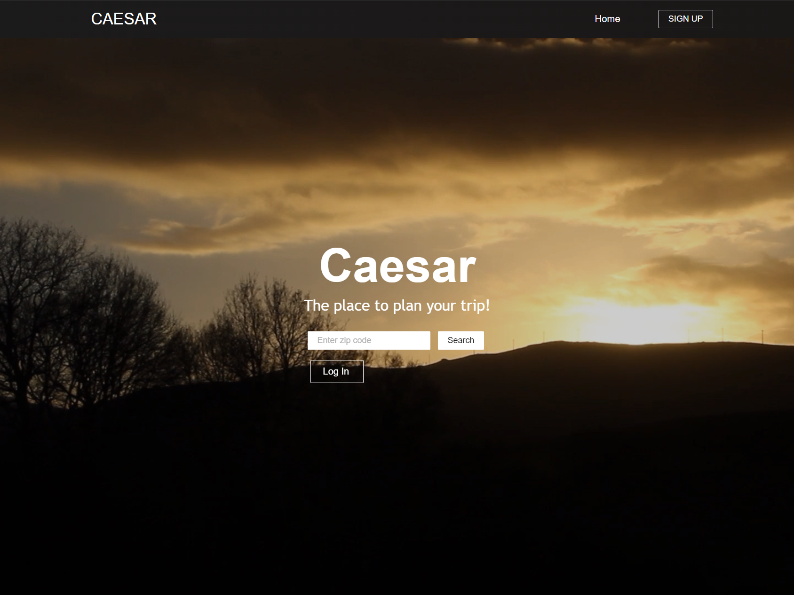

# CAESAR

## Description

## Table of contents

- [Usage](#Usage)
- [Visuals](#Visuals)
- [Credits](#Credits)
- [License](#License)

## Usage

This application runs on the browser.

To run the code locally: 

> Clone the repository. 
> Download required packages: npm i. 
> Start the program: npm run develop. 
> The local application may be accessed on your browser using: http://localhost:3000/

## Visuals

## Credits

## License

[MIT LICENSE](https://raw.githubusercontent.com/Ruskin20/Travel-Log/master/LICENSE)
